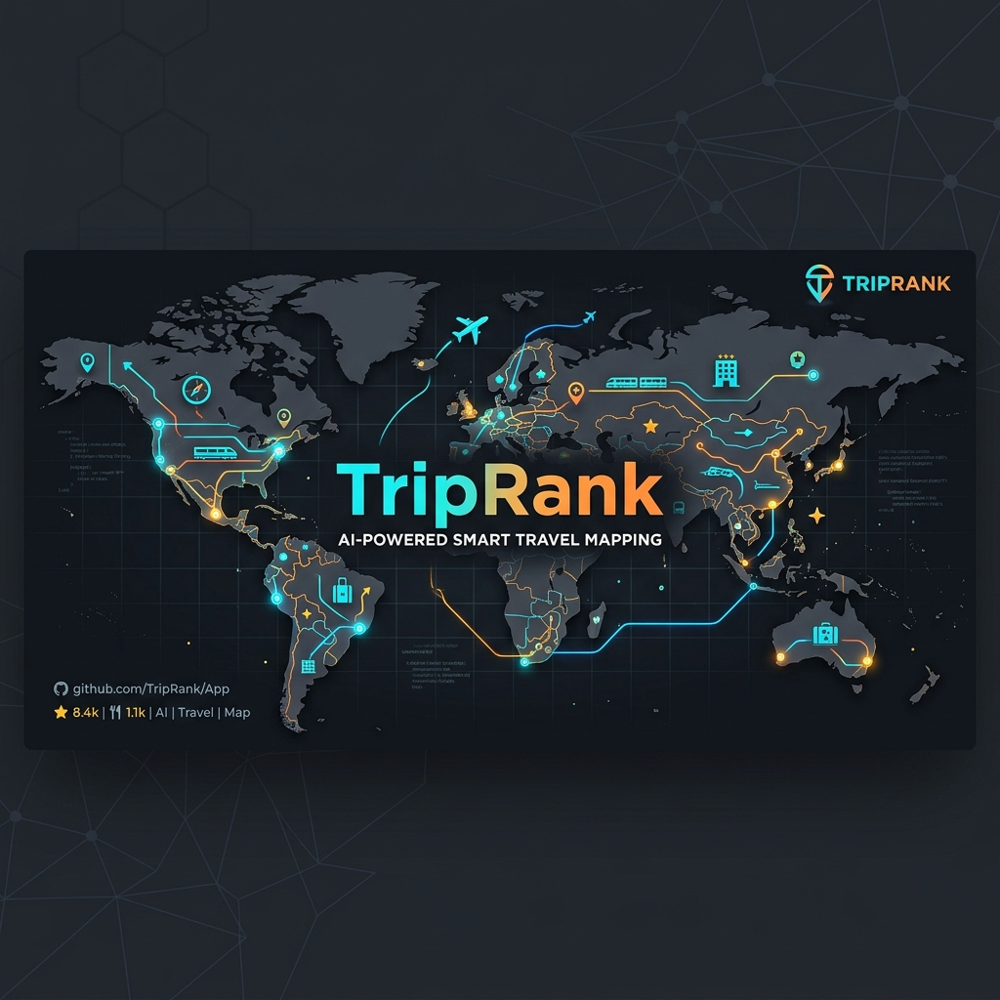

# TripRank

TripRank is an intelligent, AI-powered travel and navigation assistant designed to help you rank, plan, and navigate your daily commutes and trips efficiently.

## 🚀 Download the App

You don't need to build from source to use TripRank! 

You can directly download the compiled Android app and install it on your device:
👉 **[Click here to download the latest APK file from our Releases page](../../releases/latest)**

*(Note: Ensure you allow installation from unknown sources in your Android settings to install the APK.)*

---

## 🌟 What is TripRank and Why is it Helpful?

Navigating daily traffic and planning trips can be overwhelming. TripRank solves this by providing a smart mapping interface (powered by OpenStreetMap) that goes beyond simple directions. 

**Key Benefits:**
- **Smart Planning:** Helps you evaluate and rank the best routes or destinations.
- **Real-Time Context:** Keeps you informed about speed cameras, traffic, and local travel constraints.
- **Privacy-First Trust:** Built with a transparent permission model ensuring your location data is handled securely.
- **Customizable Preferences:** Set budgets, vehicle types, travel dates, and personal interests to get highly tailored trip suggestions.

## 🇮🇳 Tailored for Indian Users

TripRank has been specifically modified and localized from the ground up to perfectly suit the needs of users in India:

- **Default Regional Configuration:** The app defaults to **India** as the primary country, immediately aligning currency, units (Metric system/KMPH), and regional defaults to the Indian context.
- **Vehicle Customization:** Indian roads are incredibly diverse. TripRank supports setting specific vehicle types such as **2-Wheelers**, which is crucial for accurate ETA and route calculations in dense Indian cities.
- **Speed Camera & Safety Alerts:** Configured to highlight speed cameras and safety zones typical of Indian highways and city junctions, helping you avoid fines and drive safely.
- **Local Nuances:** The onboarding flow intuitively understands Indian travel behaviors, asking the right questions about budget, dates, and trust to provide a localized mapping experience.

---

## 🛠️ Run Locally (For Developers)

**Prerequisites:**  [Android Studio](https://developer.android.com/studio)

1. Open Android Studio
2. Select **Open** and choose the directory containing this project.
3. Allow Android Studio to fix any incompatibilities as it imports the project.
4. Create a file named `.env` in the project directory and set `GEMINI_API_KEY` in that file to your Gemini API key (see `.env.example` for an example).
5. Run the app on an emulator or physical device.
