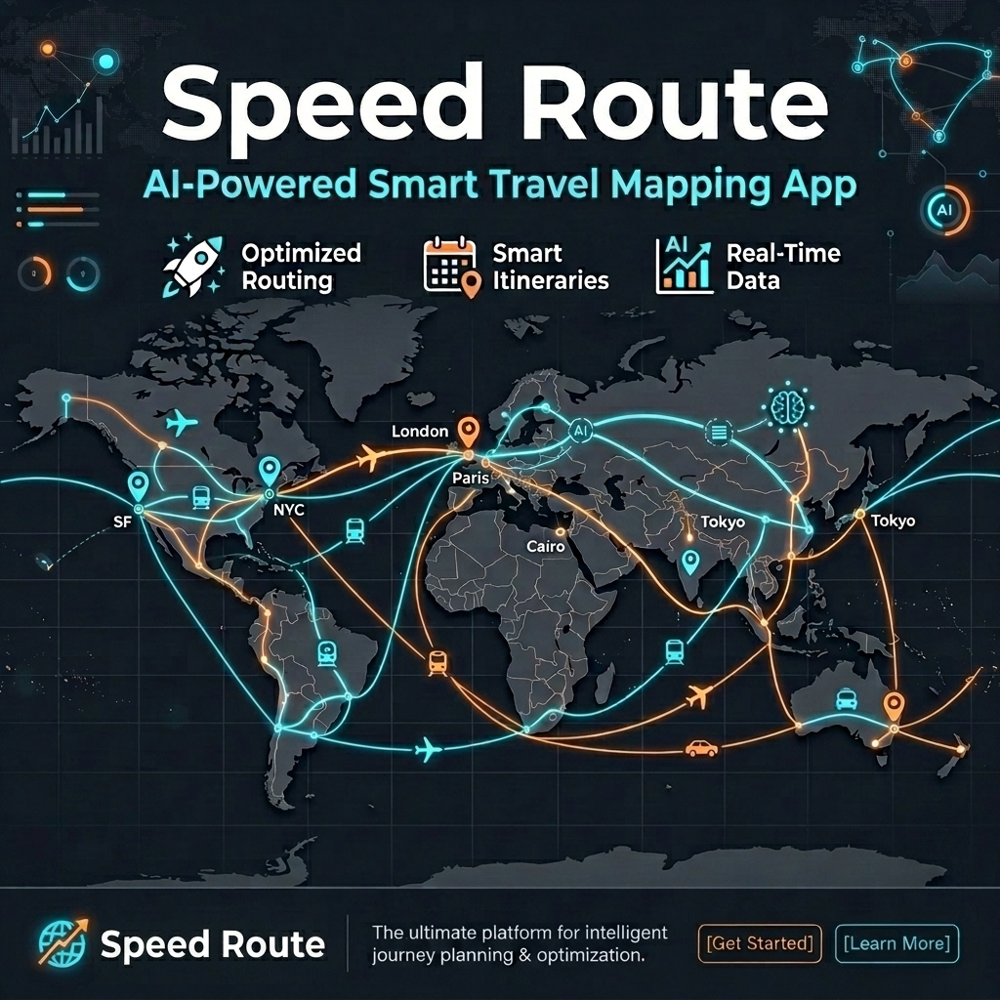

  
  
   
  
  <h1>SpeedRoute</h1>
  
  

    <strong>The intelligent, AI-powered travel and navigation assistant.</strong>
  

  

    
    
    
    
  

---

  SpeedRoute is designed to help you rank, plan, and navigate your daily commutes and trips efficiently using cutting-edge real-time tracking and open-source intelligence.

---

## 📖 Table of Contents
- [✨ Key Features](#-key-features)
- [🇮🇳 Tailored for Indian Users](#-tailored-for-indian-users)
- [🚀 Download the App](#-download-the-app)
- [🛠️ Tech Stack](#️-tech-stack)
- [💻 Run Locally](#-run-locally-for-developers)
- [🤝 Contributing](#-contributing)

---

## ✨ Key Features

Navigating daily traffic and planning trips can be overwhelming. SpeedRoute solves this by providing a smart mapping interface powered by OpenStreetMap that goes beyond simple directions.

- 🧠 **Smart Planning:** Helps you evaluate and rank the best routes or destinations.
- ⚡ **Real-Time Context:** Keeps you informed about speed cameras, traffic, and local travel constraints.
- 🔒 **Privacy-First Trust:** Built with a transparent permission model ensuring your location data is handled securely locally.
- 🎨 **Customizable Preferences:** Set budgets, vehicle types, travel dates, and personal interests to get highly tailored trip suggestions.
- 🏆 **Global Leaderboard:** Compete with other users for the fastest commutes and the most top speeds achieved securely on Firebase.

---

## 🇮🇳 Tailored for Indian Users

SpeedRoute has been specifically modified and localized from the ground up to perfectly suit the needs of users in India:

> **Default Regional Configuration:** The app defaults to **India** as the primary country, immediately aligning currency, units (Metric system / KMPH), and regional defaults to the Indian context.

> **Vehicle Customization:** Indian roads are incredibly diverse. SpeedRoute supports setting specific vehicle types such as **2-Wheelers**, which is crucial for accurate ETA and route calculations in dense Indian cities.

> **Speed Camera & Safety Alerts:** Configured to highlight speed cameras and safety zones typical of Indian highways and city junctions, helping you avoid fines and drive safely.

> **Local Nuances:** The onboarding flow intuitively understands Indian travel behaviors, asking the right questions about budget, dates, and trust to provide a localized mapping experience.

---

## 🚀 Download the App

You don't need to build from source to use SpeedRoute! 

You can directly download the compiled Android app and install it on your device:

> 👉 **[Click here to download the latest APK file from our Releases page](../../releases/latest)**

*(Note: Ensure you allow installation from unknown sources in your Android settings to install the APK.)*

---

## 🛠️ Tech Stack

This app is built using modern Android development practices:

- **Language:** Kotlin
- **Mapping:** OpenStreetMap (OSM)
- **Database:** Firebase Cloud Firestore
- **AI/ML:** Google Gemini API for intelligent route suggestions
- **Architecture:** MVVM, Coroutines, Flow

---

## 💻 Run Locally (For Developers)

Ready to contribute or see how SpeedRoute works under the hood?

### Prerequisites
- [Android Studio](https://developer.android.com/studio) (Latest Version recommended)
- A physical Android device or an Android Emulator

### Setup Instructions

1. **Clone & Open:** Open Android Studio, select **Open**, and choose the directory containing this project.
2. **Gradle Sync:** Allow Android Studio to fix any incompatibilities and sync gradle dependencies as it imports the project.
3. **Configure Environment Variables:** 
   - Create a file named `.env` in the root project directory.
   - Set `GEMINI_API_KEY` in that file to your Gemini API key (see `.env.example` for an example).
4. **Run:** Hit the ▶️ **Run** button and launch the app on your emulator or physical device.

---

## 🤝 Contributing

We love contributions! If you'd like to help make SpeedRoute even better:

1. Fork the project.
2. Create your feature branch (`git checkout -b feature/AmazingFeature`).
3. Commit your changes (`git commit -m 'Add some AmazingFeature'`).
4. Push to the branch (`git push origin feature/AmazingFeature`).
5. Open a Pull Request.

---

  
Built with ❤️ by the SpeedRoute Team

